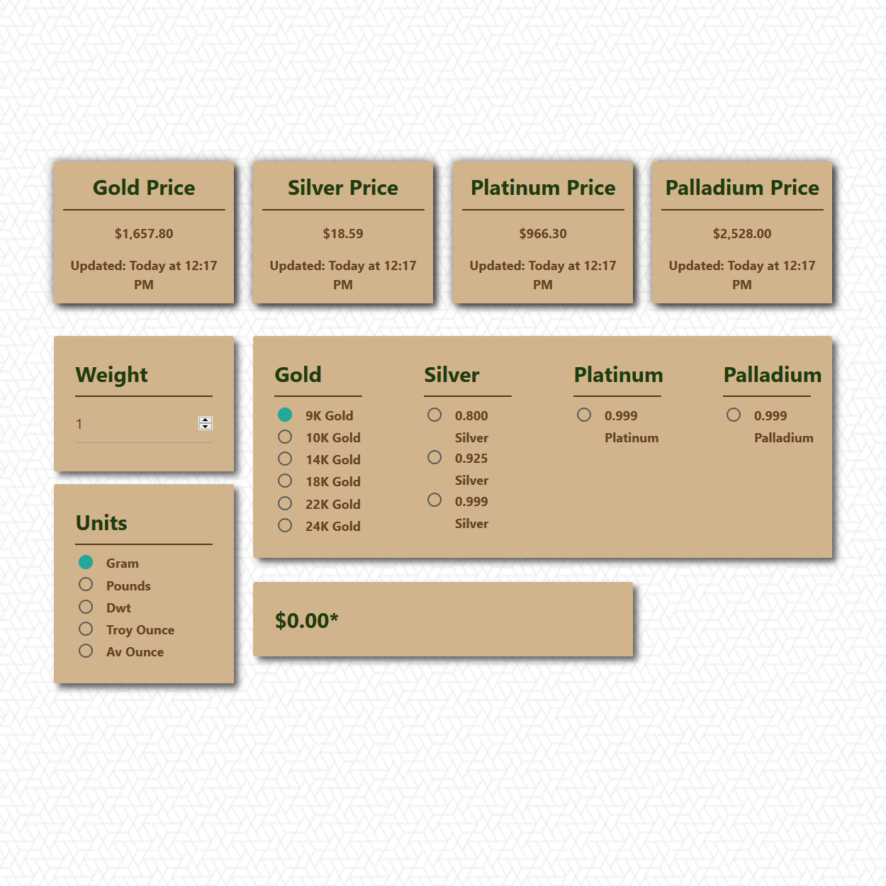

# Precious Metals Calculator 
 
## Description

A live calculator someone might want to use

This project uses:
* Chartist for easy chart implementation
* Finnhub for current and historical prices
* Materialize for CSS Framework

API reasearch: Kermit
Front-end: Kermit and Conrad
Back-end: Daniel

Most of our challenges was trying to find the API to use. It was difficult to find a API that didn’t cost money.

In the future we would like to add:
* Different currencies we could convert from.
* Mobile support
## Table of Contents
* [Credits](#Credits)
* [Contributing](#Contributing)
* [License](#License)
## Credits
[ Daniel Vasquez Talavera](https://github.com/DVasquez4155) [ Conrad](https://github.com/ConradRodgers) [ Kermit Bonner](https://github.com/krease23)
## Contributing
This project has adopted the code of conduct defined by [Contributor Covenant](https://www.contributor-covenant.org/version/2/0/code_of_conduct/).
## License
Licensed under the [MIT License](https://choosealicense.com/licenses/mit/) license.